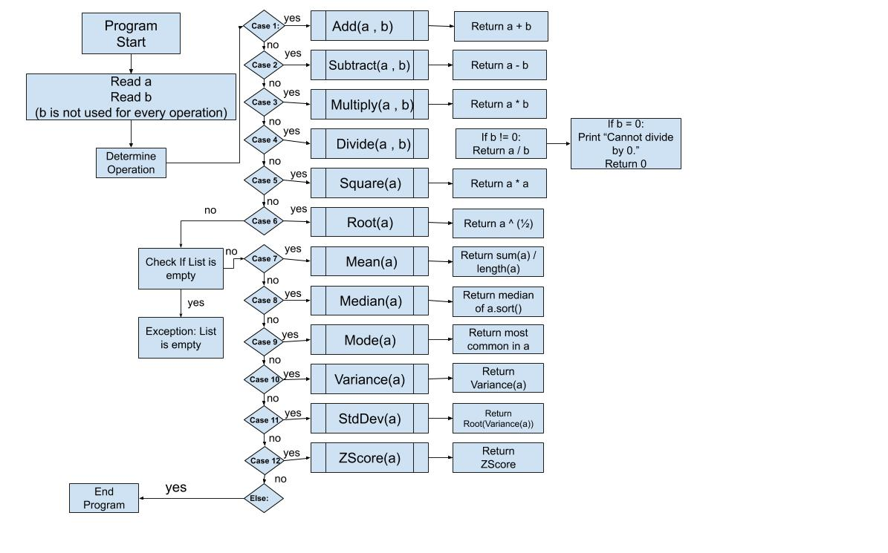

# statsCalculator

## ChangeLog
  * rnunes110220
    * work on initial setup (docker, python, etc.)
    * split previous project files into more modular setup
    * complete travisCI integration
    
  * rnunes110320
    * working on why unit tests are not running
    
  * rnunes110520
    * unit tests now working properly
    * divide by 0 error handling implemented
    * empty list error handling implemented
    * added statistics modules with mean and median methods
  
  * rnunes110720
    * added mode, variance, and standard deviation method to statistics module
    * added accompanying tests  
    
  * ericbrod110720
    * Reduced Code in Unit Tests
    * Building Program Diagram
    